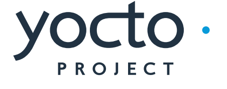

### Hi there, I'm [Daniel Selvan][aboutme] 👋🏽

[][stackoverflow]
[][youtube]
[][twitter]
[][linkedin]
[][instagram]

 

## I'm an Engineer, Developer, Designer and a lifelong Learner!

<!--
**danie007/danie007** is a ✨ _special_ ✨ repository because its `README.md` (this file) appears on your GitHub profile.
-->

- 🔭 I’m currently working on **Securing Cyber-Physical Systems**
- 🌱 I’m currently learning **Embedded C**, [Flutter](https://www.appbrewery.co/p/flutter-development-bootcamp-with-dart) & everything
- 👯 I’m looking to collaborate on [Fun projects with Raspberry Pi](https://github.com/danie007/ReSpeaker-4-Mic-Array-for-Raspberry-Pi)
- 🤔 I’m looking for help with [Linux Scripting](https://github.com/danie007/.bash_aliases)
- 💬 Ask me about **Embedded systems**, **Python**
- 😝 Fun fact: There's no **Cloud**, it's just **Someone else's computer**

### Languages and Tools:

[][linkedin]
[][linkedin]
[][linkedin]
[][linkedin]
[][linkedin]
[][linkedin]
[][linkedin]
[][linkedin]
[][linkedin]
[][linkedin]

 
 

---

  
:zap: Github Top Langs

  
  *NOTE: Top languages does not indicate my skill level or something like that, it's a GitHub metric of which languages I have the most code on github, it's a new feature of [github-readme-stats](https://github.com/danie007/github-readme-stats)*

[aboutme]: https://about.me/meetdaniel
[twitter]: https://twitter.com/botfordani
[youtube]: https://www.youtube.com/channel/UCz5w2C2FJENwqm9PBI8FrYg
[instagram]: https://instagram.com/danied007
[linkedin]: https://www.linkedin.com/in/danielselvan/
[stackoverflow]: https://stackoverflow.com/users/10773894/daniel?tab=profile
